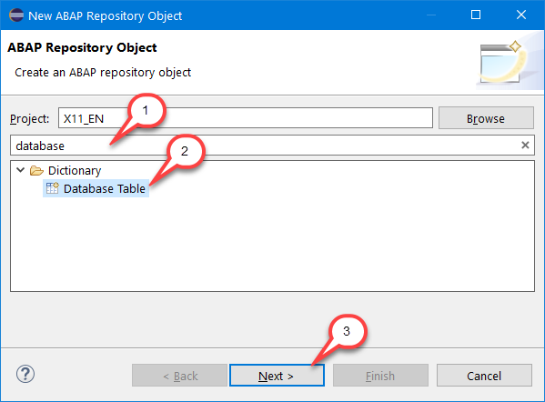
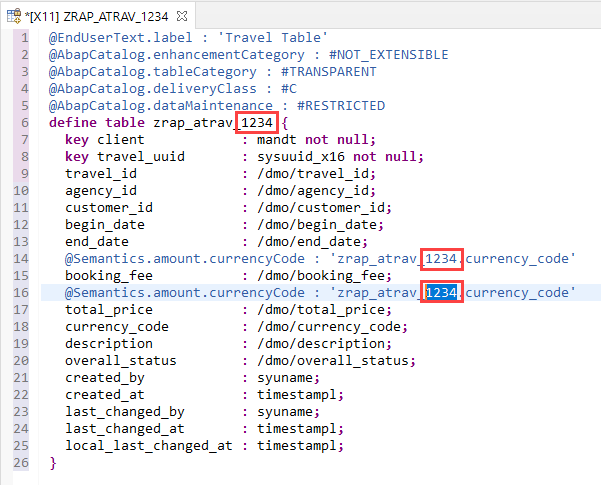
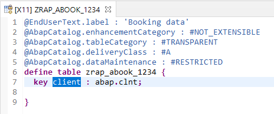
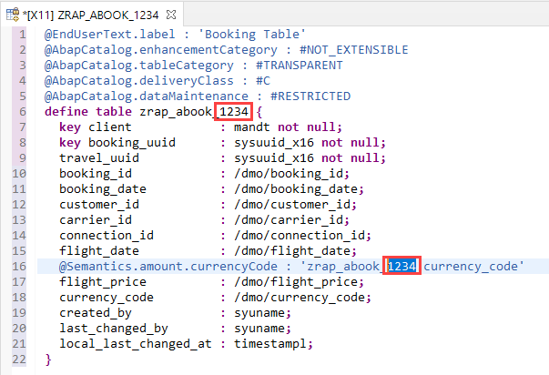
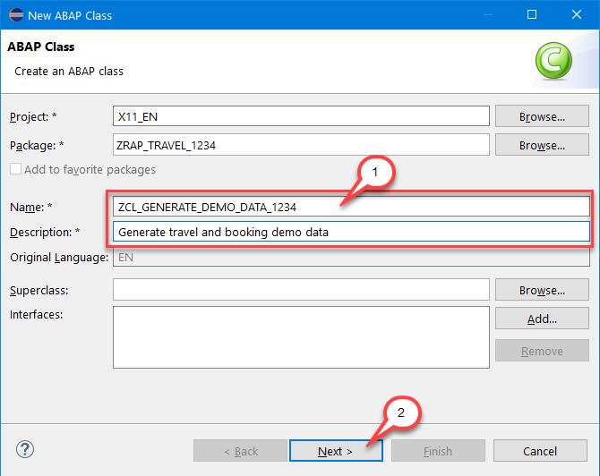

# Exercise 1 - Database Tables

## Introduction
You've already defined a group-id and created an ABAP package as described in the [Getting Started](/exercises/ex0/README.md) section.

In this exercise you will create two database tables to store the **travel** and **booking** data. You'll also create a little helper class to populate some sample data into both tables.

The data model in this workshop consists of two transactional tables (**travel** and **booking**) as well as some master data that we will re-use from the already existing demo content (**Agency**, **Customer** and **Flight**), as well as a few more.

## Exercise 1.1 - Create the Travel database table
A Travel entity defines general travel data, such as the agency ID or customer ID, the overall status of the travel and the price of travel.   
1. Right click on your package **`ZRAP_TRAVEL_####`** (where `####` is your group-id), choose **_New > Other ABAP Repository Object_** from the context menu.   

   

2. Enter `database` in the search field, choose **Database table** in the list and then choose **Next**.  

   

3. Provide **`ZRAP_ATRAV_####`** (where `####` is your group-id) as name and a description (e.g. *Travel data*) in the appearing dialog and choose **Next**.  

   

4. Assign a transport request and choose **Finish**. The table is created and a new editor with the defaulted content is opened. The table-specific technical settings are specified using annotations at the top.  

     

5. Replace the source code with the code snippet provided below and replace all occurrences of `####` with your group-id. You can make use of the Replace All feature (**Ctrl+F**) in ADT for this purpose. 

    <pre>
    @EndUserText.label : 'Travel Table'
    @AbapCatalog.enhancementCategory : #NOT_EXTENSIBLE
    @AbapCatalog.tableCategory : #TRANSPARENT
    @AbapCatalog.deliveryClass : #C
    @AbapCatalog.dataMaintenance : #RESTRICTED
    define table zrap_atrav_#### {
      key client            : mandt not null;
      key travel_uuid       : sysuuid_x16 not null;
      travel_id             : /dmo/travel_id;
      agency_id             : /dmo/agency_id;
      customer_id           : /dmo/customer_id;
      begin_date            : /dmo/begin_date;
      end_date              : /dmo/end_date;
      @Semantics.amount.currencyCode : 'zrap_atrav_####.currency_code'
      booking_fee           : /dmo/booking_fee;
      @Semantics.amount.currencyCode : 'zrap_atrav_####.currency_code'
      total_price           : /dmo/total_price;
      currency_code         : /dmo/currency_code;
      description           : /dmo/description;
      overall_status        : /dmo/overall_status;
      created_by            : syuname;
      created_at            : timestampl;
      last_changed_by       : syuname;
      last_changed_at       : timestampl;
      local_last_changed_at : timestampl;
    }
    </pre>

     

    **Short explanation:**  
    - Some data elements from the ABAP Flight Reference Scenario (namespace `/DMO/`) are used.  
    - The table key consists of the `CLIENT` field and the `TRAVEL_UUID` field which is a technical key (16 Byte UUID).   
    - A human-readable travel identifier: `TRAVEL_ID`  
    - The field CURRENCY_CODE is specified as currency key for the amount fields `BOOKING_FEE` and `TOTAL_PRICE` using the semantic annotation `@Semantics.amount.currencyCode`   
    - Some standard administrative fields are defined: `CREATED_BY`, `CREATED_AT`, `LAST_CHANGED_BY`, `LAST_CHANGED_AT` and `LOCAL_LAST_CHANGED_AT`.  
  
6. Save  and activate  the changes.  

## Exercise 1.2 - Create the Booking database table
A Booking entity comprises general flight and booking data, the customer ID for whom the flight is booked as well as the travel ID to which the booking belongs to – and some admin fields.  
  
1. Right click on the **Database Tables** folder, choose **New Database Table** from the context menu.  

   

2. Maintain **`ZRAP_ABOOK_####`** (where `####` is your group-id) as name and a description (e.g. **_Booking data_**) in the appearing dialog and choose **Next**. 

   

3. Assign a transport request and choose **Finish**. The table is created and a new editor with the defaulted content is opened.

   

4. Replace the default source code with the code snippet provided below and replace all occurrences of  `####` with your group-id. You can make use of the Replace All feature (shortcut **Ctrl+F**) in ADT for this purpose.  

    <pre> 
    @EndUserText.label : 'Booking Table'
    @AbapCatalog.enhancementCategory : #NOT_EXTENSIBLE
    @AbapCatalog.tableCategory : #TRANSPARENT
    @AbapCatalog.deliveryClass : #C
    @AbapCatalog.dataMaintenance : #RESTRICTED
    define table zrap_abook_#### {
      key client            : mandt not null;
      key booking_uuid      : sysuuid_x16 not null;
      travel_uuid           : sysuuid_x16 not null;
      booking_id            : /dmo/booking_id;
      booking_date          : /dmo/booking_date;
      customer_id           : /dmo/customer_id;
      carrier_id            : /dmo/carrier_id;
      connection_id         : /dmo/connection_id;
      flight_date           : /dmo/flight_date;
      @Semantics.amount.currencyCode : 'zrap_abook_####.currency_code'
      flight_price          : /dmo/flight_price;
      currency_code         : /dmo/currency_code;
      created_by            : syuname;
      last_changed_by       : syuname;
      local_last_changed_at : timestampl;
    }
    </pre>   

    
  
    **Short explanation:**
    - The table key consists of the `CLIENT` field and the `BOOKING_UUID` field which is a technical key (16 Byte UUID).   
    - A human-readable travel identifier: `BOOKING_ID`  
    - Some standard administrative fields are defined: `CREATED_BY`, `LAST_CHANGED_BY`, and `LOCAL_LAST_CHANGED_AT`.  
  
5. Save  and activate  the changes.  
  
## Exercise 1.3 - Fill the Tables with Demo Data
Create a little helper class to fill some demo data into the previously created tables. For this purpose, demo data provided by the ABAP Flight Reference Scenario (main package: `/DMO/FLIGHT`) will be used.   
  
1. Right click on your package **ZRAP_TRAVEL_####** and choose **_New > ABAP Class_** from the context menu.      

   

2. Provide **`ZCL_GENERATE_DEMO_DATA_####`** (where `####` is your group-id) as name and a description (e.g. **_Generate travel and booking demo data_**) in the creation wizard for the new ABAP class and choose **Next**.

    

3. Assign a transport request and choose **Finish**. Replace the entire code with the snippet provided below and replace all occurrences of `####` with your group-id.

    <pre> 
    CLASS zcl_generate_demo_data_#### DEFINITION
      PUBLIC
      FINAL
      CREATE PUBLIC .

      PUBLIC SECTION.
        INTERFACES if_oo_adt_classrun.
      PROTECTED SECTION.
      PRIVATE SECTION.
    ENDCLASS.

    CLASS zcl_generate_demo_data_#### IMPLEMENTATION.
      METHOD if_oo_adt_classrun~main.

        " delete existing entries in the database table
        DELETE FROM zrap_atrav_####.
        DELETE FROM zrap_abook_####.

        " insert travel demo data
        INSERT zrap_atrav_#### FROM (
            SELECT
              FROM /dmo/travel
              FIELDS
                uuid(  )      AS travel_uuid           ,
                travel_id     AS travel_id             ,
                agency_id     AS agency_id             ,
                customer_id   AS customer_id           ,
                begin_date    AS begin_date            ,
                end_date      AS end_date              ,
                booking_fee   AS booking_fee           ,
                total_price   AS total_price           ,
                currency_code AS currency_code         ,
                description   AS description           ,
                CASE status
                  WHEN 'B' THEN 'A' " accepted
                  WHEN 'X' THEN 'X' " cancelled
                  ELSE 'O'          " open
                END           AS overall_status        ,
                createdby     AS created_by            ,
                createdat     AS created_at            ,
                lastchangedby AS last_changed_by       ,
                lastchangedat AS last_changed_at       ,
                lastchangedat AS local_last_changed_at
                ORDER BY travel_id UP TO 200 ROWS
          ).
        COMMIT WORK.

        " insert booking demo data
        INSERT zrap_abook_#### FROM (
            SELECT
              FROM   /dmo/booking    AS booking
                JOIN zrap_atrav_#### AS z
                ON   booking~travel_id = z~travel_id
              FIELDS
                uuid( )                 AS booking_uuid          ,
                z~travel_uuid           AS travel_uuid           ,
                booking~booking_id      AS booking_id            ,
                booking~booking_date    AS booking_date          ,
                booking~customer_id     AS customer_id           ,
                booking~carrier_id      AS carrier_id            ,
                booking~connection_id   AS connection_id         ,
                booking~flight_date     AS flight_date           ,
                booking~flight_price    AS flight_price          ,
                booking~currency_code   AS currency_code         ,
                z~created_by            AS created_by            ,
                z~last_changed_by       AS last_changed_by       ,
                z~last_changed_at       AS local_last_changed_by
          ).
        COMMIT WORK.

        out->write( 'Travel and booking demo data inserted.').
      ENDMETHOD.

    ENDCLASS.
   </pre>

5. Save  and activate  the changes.  
  
6. Press **F9** to run the ABAP class as a console application. As a result, you will see a success message in the console.

   

7. You can preview the data from the travel and booking tables. Choose the relevant table (`ZRAP_ATRAV_####` or `ZRAP_ABOOK_####`) in the Project Explorer and press **F8**. 
    
## Summary

Now that you've... 
- created both database tables and 
- filled them with sample data, 

you can continue with - [Exercise 2 - Core Data Services (CDS) Data Model](../ex2/README.md)

## Appendix

Find the source code for the database tables and the helper class in the [sources](sources) folder. Don't forget to replace the placeholder `####` with your group-id.

- [Table ZRAP_ATRAV_####](sources/EX1_1_TABL_ZRAP_ATRAV.txt)
- [Table ZRAP_ZRAP_ABOOK_####](sources/EX1_2_TABL_ZRAP_ABOOK.txt)
- [Class ZRAP_ZCL_GENERATE_DEMO_DATA_####](sources/EX1_3_CLAS_ZCL_GENERATE_DEMO_DATA.txt)
