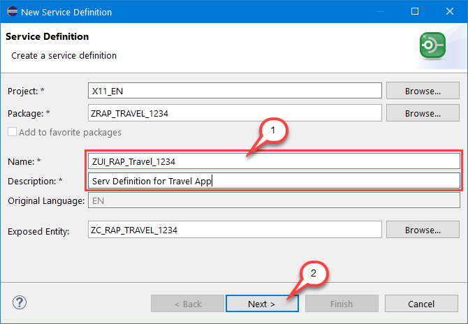
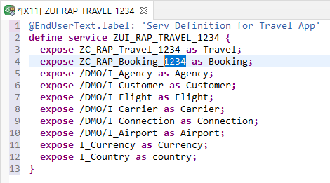
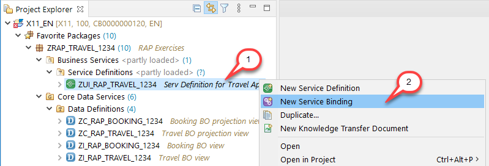
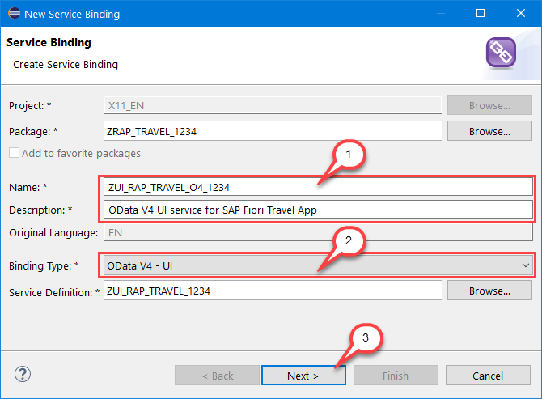
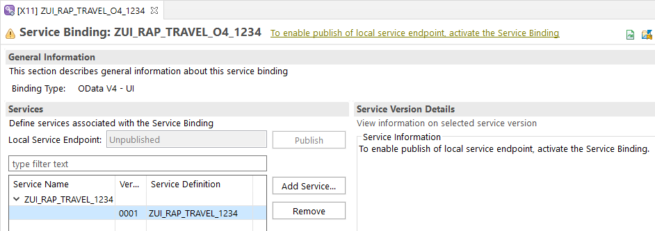
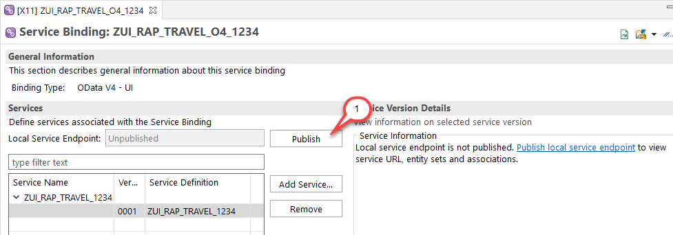
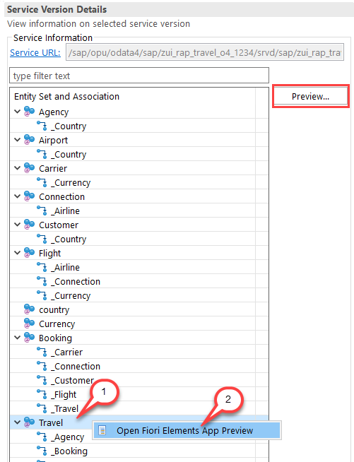
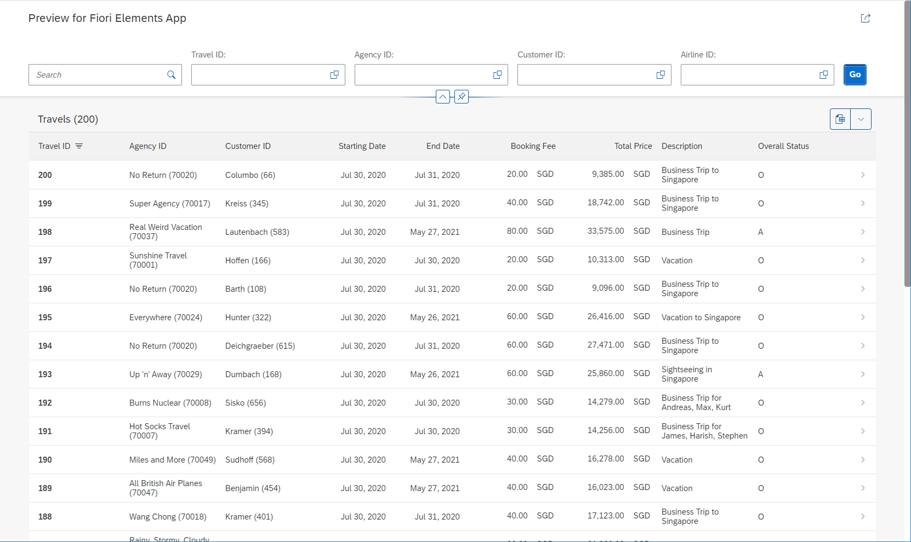

# Exercise 5 - Business Service

## Introduction
In the previous exercise you've created the metadata extensions for the travel and the booking projection views (see [Exercise 4](/exercises/ex4/README.md)).

In this exercise you will expose your projected CDS data model as OData service using business services – i.e. service definition and service binding.  

Further information can be found here: [Business Service](https://help.sap.com/viewer/923180ddb98240829d935862025004d6/Cloud/en-US/1913ad9f52e64ab5858df00a8d20c4d6.html)

## Exercise 5.1 - Create the Service Definition
The service definition specifies the service scope, i.e. the relevant entity sets to be exposed in the service.

1.	In the Project Explorer, right-click on the Travel BO projection view **`ZC_RAP_TRAVEL_####`** and select **New Service Definition** from the context menu.

    

2.	Maintain **`ZUI_RAP_Travel_####`** (where `####` is your group-id) as **name** and a **description** (e.g. _`Serv Definition for Travel App`_) in the creation wizard and choose **Next >** to continue.
 
    
              
3.	Assign a transport request and choose **Finish**. Replace the code in the editor with the code snippet provided below. Do not forget to replace all the occurrences of `####` with your group-id.
 
    <pre>
    @EndUserText.label: 'Serv Definition for Travel App'
    define service ZUI_RAP_TRAVEL_#### {
      expose ZC_RAP_Travel_#### as Travel;
      expose ZC_RAP_Booking_#### as Booking;
      expose /DMO/I_Agency as Agency;
      expose /DMO/I_Customer as Customer;
      expose /DMO/I_Flight as Flight;
      expose /DMO/I_Carrier as Carrier;
      expose /DMO/I_Connection as Connection;
      expose /DMO/I_Airport as Airport;
      expose I_Currency as Currency;
      expose I_Country as country;
    }
    </pre>
    
    The service definition will look as follows:

    

6.	Save  and activate  the service definition.

## Exercise 5.2 - Create the Service Binding
The service binding binds your service definition to the required protocol.

1.	Right-click on the just created service definition **`ZUI_RAP_TRAVEL_####`** in the project Explorer and choose **New Service Binding** from the context menu.

    

2.	Maintain **`ZUI_RAP_TRAVEL_O4_####`** (where `####` is your group-id) as name and a description (e.g. _`OData V4 UI service for SAP Fiori Travel App`_, choose **`OData V4 - UI`** as Binding Type and choose **Next >** to continue.

    

3.	Assign a transport request and choose **Finish**. The editor opens with the created service binding.
 
    

4.	Activate  the service binding which enables the **Publish** button. Click on **Publish**.

    

5.	This locally publishes the service binding, providing access authorization to all users with a developer role. On the right-hand-side of the _Service Binding_ editor, the relative service URL and the exposed entity sets as well as associations are shown.

    

## Exercise 5.3 - Preview the Travel App

1. In the service binding, choose the `Travel` node in _**Entity Set and Association**_ area and either right-click on it and choose _**Open Fiori elements App preview**_ from the context menu or simply double-click on it – or choose the **Preview** button.
 
    

    Your SAP Fiori elements-based Travel List Report app will open in the browser. You might need to provide your login information (email address / password) to connect to the trial account. 
    
2. Press the **Go** button to load the data. 

    

    You can now explore the Travel App.
    For example, 
    - Filter bar: Filter the entries by an **`AgencyID`** using the defined value help 
    - Perform a full text search (e.g. for **`Pan`**)
    - Navigate to the detail object page of a travel record in the travel table list.
    - Check out the travel object page with its two facets Travel and Booking and navigate to the booking object page.

## Summary

Now that you've... 
- created the service definition specifying the scope of the service exposure,
- created an OData V4 service binding and published it locally, and
- used the SAP Fiori Elements App Preview to run the app, 

you can continue with - [Exercise 6 - Business Object Behavior](../ex6/README.md)

## Appendix

Find the source code for the service definition in the [sources](sources) folder. Don't forget to replace the placeholder `####` with your group-id.

- [Service Definition ZUI_RAP_TRAVEL_####](sources/EX5_1_SRVD_ZUI_RAP_TRAVEL.txt)
